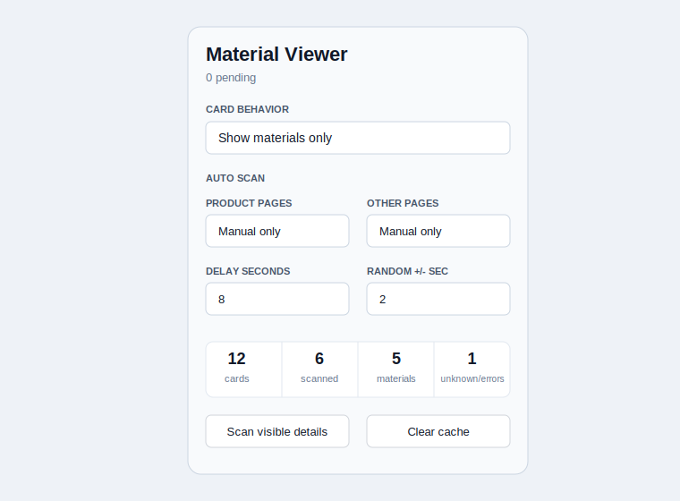
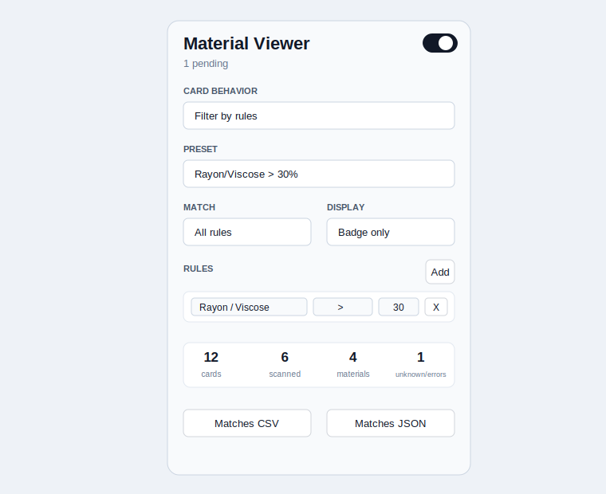
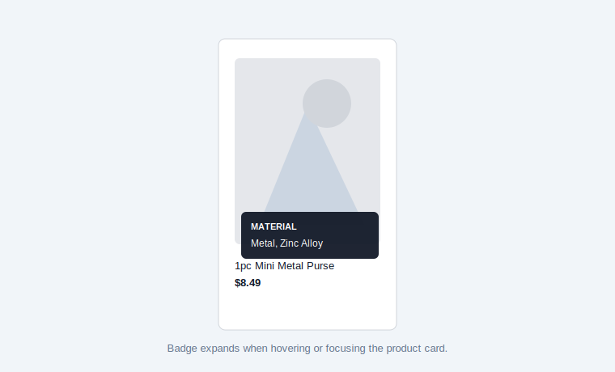
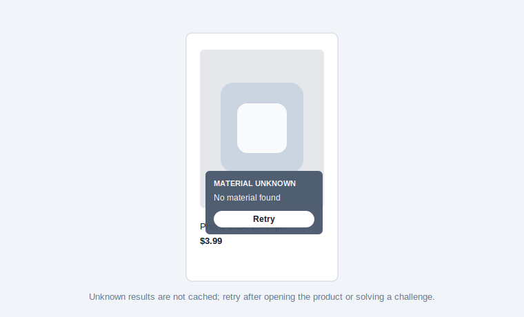
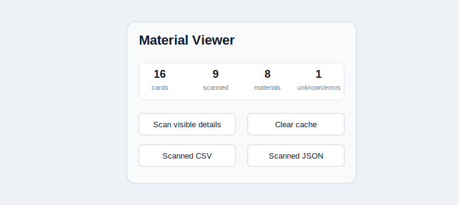

# SHEIN Material Viewer

`shein-material-viewer` is a lightweight Chrome Manifest V3 extension that displays product material information directly on SHEIN product cards. It works as a material viewer by default, and includes an optional rule-based filter mode for fabric percentages and material combinations.

The extension was built for situations where SHEIN does not provide a useful material filter, such as finding clothing with rayon/viscose over 30%, checking for 100% cotton, or seeing what a phone case, purse, accessory, or bag is made from without opening every product manually.



## Features

- Shows material badges on SHEIN product cards.
- Works across SHEIN listing/search/category grids, not only clothing pages.
- Supports clothing fibers and non-clothing materials such as TPU, PC, silicone, metal, zinc alloy, PU leather, resin, rubber, and tempered glass.
- Fetches product detail pages only when you manually scan visible cards or enable deliberately slow auto scan.
- Extracts material data from SHEIN detail-page scripts, especially `materialExposed.materialInfoList`.
- Parses percentages such as `65% Polyester, 35% Viscose`.
- Parses plain material values such as `PC + TPU`, `Metal`, and `Tempered Glass`.
- Treats `viscose`, `rayon`, `modal`, and `lyocell` as the same rayon-family key.
- Treats `spandex` and `elastane` as the same material family.
- Shows `Material unknown` with a Retry button when a product has no extractable material data.
- Does not cache unknown/error results.
- Caches successful product scans by product/variant key in `chrome.storage.local`.
- Preserves variant parameters such as `attr_ids` so one variant does not reuse another variant's material.
- Exports scanned products as CSV or JSON.
- Includes optional filter mode with rules, presets, dim/hide/badge display modes, and match exports.
- Handles SHEIN AJAX/grid updates with DOM observation and badge cleanup.

## Screenshots

These repository screenshots are documentation mockups that mirror the extension states.

| Viewer popup | Filter popup |
| --- | --- |
|  |  |

| Material badge | Unknown/retry badge | Export controls |
| --- | --- | --- |
|  |  |  |

## Quick Start

1. Open `chrome://extensions`.
2. Enable **Developer mode**.
3. Click **Load unpacked**.
4. Select this folder: `/Users/hashir/Documents/shein`.
5. Open a SHEIN listing, search, category, or product page.
6. Click the extension icon.
7. Use **Scan visible details** or the per-card **Scan** button to fetch material data.

The default card behavior is **Show materials only**. In that mode, cards never show `Match` or `No match`, and products are never hidden or dimmed.

## Popup Controls

- **Card behavior**: choose `Show materials only` or `Filter by rules`.
- **Product pages**: choose whether opened product detail pages are scanned manually or automatically.
- **Other pages**: choose whether listing/search/category pages scan manually or with slow auto scan.
- **Delay seconds**: base delay between product detail fetches.
- **Random +/- sec**: random jitter added around the base delay to avoid repeated identical timing.
- **Scan visible details**: queues visible product cards for detail-page material extraction.
- **Clear cache**: removes cached successful scans and current session results.
- **Scanned CSV / Scanned JSON**: exports scanned products visible in the current page context.

In filter mode, extra controls appear:

- **Preset**: choose a ready-made rule set.
- **Match**: require all rules or any rule.
- **Display**: dim, hide, or badge-only for non-matching products.
- **Rules**: add material/comparator/percentage rules.
- **Matches CSV / Matches JSON**: export only matching products.

## Scan Modes

The extension is intentionally conservative because SHEIN may rate-limit repeated detail-page requests.

- **Manual only** is the safest default.
- **Scan visible details** scans only products currently visible in the viewport.
- **Auto slow** scans visible/intersecting products one at a time.
- **Delay seconds** and **Random +/- sec** control pacing between fetches.
- If SHEIN redirects to a challenge page, the queue stops. Solve the challenge yourself, then retry.

Recommended safe starting point:

```text
Product pages: Manual only
Other pages: Manual only
Delay seconds: 8
Random +/- sec: 2
```

## Material Extraction

The parser keeps raw material labels and normalizes common aliases for matching/filtering.

Examples:

| Input text | Parsed display |
| --- | --- |
| `100% Cotton` | `100% Cotton` |
| `65% Polyester, 35% Viscose` | `65% Polyester, 35% Rayon / Viscose` |
| `Viscose 40%, Polyester 60%` | `40% Rayon / Viscose, 60% Polyester` |
| `PC + TPU` | `Polycarbonate / PC, TPU` |
| `PU Leather` | `PU Leather` |
| `Zinc Alloy, Silicone` | `Zinc Alloy, Silicone` |
| `Tempered Glass` | `Tempered Glass` |

Supported common material families include:

- Rayon / viscose / modal / lyocell
- Cotton
- Polyester
- Elastane / spandex
- Linen
- Polyamide / nylon
- Wool
- Acrylic
- TPU
- Polycarbonate / PC
- PU leather
- Silicone
- Tempered glass
- Plastic
- Metal
- Zinc alloy
- Aluminum
- Resin
- Rubber

New materials can still appear because the parser preserves unknown raw material names.

## Optional Filter Mode

Filter mode keeps the original material-rule functionality for clothing and fabric shopping.

Built-in presets:

- Rayon/Viscose > 30%
- 100% Cotton
- Polyester + Rayon
- No Polyester

Rule comparators:

- `>`
- `>=`
- `=`
- `<=`
- `<`
- `contains`
- `not contains`

Numeric percentage rules only pass when the material has a known numeric percentage. `contains` rules pass when the material exists, even without a percentage.

## Export Format

CSV and JSON exports include:

- Product ID
- Base SHEIN product ID
- Title
- URL
- Price text
- Raw material/composition text
- Parsed material summary
- Source
- Scan timestamp
- Error state, if any

## Privacy

This extension runs only on `https://*.shein.com/*`.

It stores data locally in Chrome extension storage:

- Settings
- Successful product material scans
- Discovered material labels

It does not send data to a third-party server. Background detail fetches use the browser session and SHEIN cookies because they are same-site requests from the content script.

The extension does not infer materials from product titles or listing-card marketing text. Product titles are stored only as product metadata for badges and exports.

Variant-specific URLs are treated separately when SHEIN provides `attr_ids`. This avoids using one variant's material data for another variant of the same base product.

## Limitations

- SHEIN does not always expose full material data in listing-card metadata.
- Some product pages may not include material data in a parseable script.
- Some materials may be marketing text rather than precise composition.
- SHEIN challenge/captcha pages must be solved manually.
- Auto scan should be used slowly to reduce rate-limit risk.
- Real product-card layout varies by SHEIN page type, so badge placement is intentionally compact.

## Documentation

- [User Guide](docs/USER_GUIDE.md)
- [Technical Architecture](docs/TECHNICAL.md)
- [Troubleshooting](docs/TROUBLESHOOTING.md)
- [Development Guide](docs/DEVELOPMENT.md)
- [Contributing](CONTRIBUTING.md)
- [Changelog](CHANGELOG.md)

## Development

No build step is required.

Run tests:

```sh
npm test
```

Or run the test file directly:

```sh
node tests/parser.test.mjs
```

Run syntax checks:

```sh
node --check src/shared/logic.js
node --check src/content.js
node --check src/popup.js
```

## Repository Layout

```text
.
├── manifest.json
├── src/
│   ├── content.js
│   ├── content.css
│   ├── popup.html
│   ├── popup.css
│   ├── popup.js
│   └── shared/logic.js
├── tests/
│   └── parser.test.mjs
└── docs/
    ├── USER_GUIDE.md
    ├── TECHNICAL.md
    ├── TROUBLESHOOTING.md
    ├── DEVELOPMENT.md
    └── screenshots/
```

## License

MIT. See [LICENSE](LICENSE).
